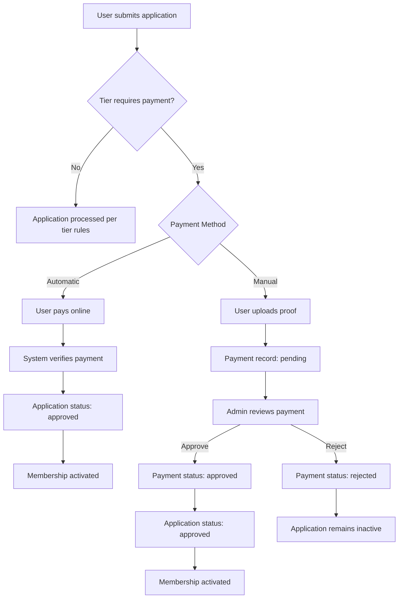

# Membership Activation Types and Scenarios

This document outlines the different membership activation types available in the system and how they work.

## Activation Types

The system supports the following activation types for membership tiers:
(todo: notices, explainers, and redirects should be added for each activation type)
| Activation Type | Description |
|-----------------|-------------|
| `automatic` | Membership is automatically activated upon application submission. No review or payment required. |
| `review_required` | Admin must review and approve the application before membership is activated. |
| `form_required` | User must complete a form, after which membership is automatically activated. |
| `form_then_review` | User must complete a form, then an admin must review and approve the application. |
| `payment_required` | User must complete payment, after which membership is automatically activated. |
| `form_then_payment` | User must complete a form, then make payment, after which membership is automatically activated. (bug 3 applications created) |
| `form_then_payment_then_review` | User must complete a form, make payment, then an admin must review and approve. | (bug redirected to checkout, bug request payment shown on approve button, multiple pending payment applications created)
| `review_then_payment` | Admin must review the application first, then user makes payment to activate. |
| `form_then_review_then_payment` | User must complete a form, admin reviews the application, then user makes payment to activate. (bug 3 applications created, activated immediately even before payment) |

## Application Status Flow

Applications can have the following statuses:

- `pending`: Waiting for admin review
- `pending_payment`: Waiting for payment
- `approved`: Application has been approved
- `rejected`: Application has been rejected
- `expired`: Application has expired

## Activation Scenarios

### Automatic Activation

1. User submits application for a membership tier with `automatic` activation type
2. System:
   - Creates an application with status `approved`
   - Creates a membership record with status `active`
   - Sets the group user to active
3. User is immediately granted membership benefits

### Review Required

1. User submits application for a membership tier with `review_required` activation type
2. System creates an application with status `pending`
3. Admin reviews the application
4. If approved:
   - Application status is updated to `approved`
   - Membership record is created with status `active`
   - Group user is set to active
5. If rejected:
   - Application status is updated to `rejected`
   - No membership record is created

### Payment Required

1. User submits application for a membership tier with `payment_required` activation type
2. System creates an application with status `pending_payment`
3. User is redirected to checkout
4. Upon successful payment:
   - Application status is updated to `approved`
   - Membership record is created with status `active`
   - Group user is set to active

### Form Required

1. User submits application with form data for a membership tier with `form_required` activation type
2. System:
   - Stores form response
   - Creates an application with status `approved`
   - Creates a membership record with status `active`
   - Sets the group user to active
3. User is immediately granted membership benefits

### Form Then Review

1. User submits application with form data for a membership tier with `form_then_review` activation type
2. System:
   - Stores form response
   - Creates an application with status `pending`
3. Admin reviews the application and form data
4. If approved:
   - Application status is updated to `approved`
   - Membership record is created with status `active`
   - Group user is set to active
5. If rejected:
   - Application status is updated to `rejected`
   - No membership record is created

### Form Then Payment

1. User submits application with form data for a membership tier with `form_then_payment` activation type
2. System:
   - Stores form response
   - Creates an application with status `pending_payment`
3. User is redirected to checkout
4. Upon successful payment:
   - Application status is updated to `approved`
   - Membership record is created with status `active`
   - Group user is set to active

### Form Then Payment Then Review

1. User submits application with form data for a membership tier with `form_then_payment_then_review` activation type
2. System:
   - Stores form response
   - Creates an application with status `pending_payment`
3. User is redirected to checkout
4. Upon successful payment:
   - Application status is updated to `pending`
5. Admin reviews the application and form data
6. If approved:
   - Application status is updated to `approved`
   - Membership record is created with status `active`
   - Group user is set to active
7. If rejected:
   - Application status is updated to `rejected`
   - No membership record is created
   - Payment may be refunded (handled separately)

### Review Then Payment

1. User submits application for a membership tier with `review_then_payment` activation type
2. System creates an application with status `pending`
3. Admin reviews the application
4. If pre-approved:
   - Application status is updated to `pending_payment`
   - User is notified to complete payment
5. Upon successful payment:
   - Application status is updated to `approved`
   - Membership record is created with status `active`
   - Group user is set to active
6. If rejected during review:
   - Application status is updated to `rejected`
   - No membership record is created

### Form Then Review Then Payment

1. User submits application with form data for a membership tier with `form_then_review_then_payment` activation type
2. System:
   - Stores form response
   - Creates an application with status `pending`
3. Admin reviews the application and form data
4. If pre-approved:
   - Application status is updated to `pending_payment`
   - User is notified to complete payment
5. Upon successful payment:
   - Application status is updated to `approved`
   - Membership record is created with status `active`
   - Group user is set to active
6. If rejected during review:
   - Application status is updated to `rejected`
   - No membership record is created

## Implementation Details

### Automatic Activation Implementation

When an application is created with automatic activation:

1. In `createMembershipApplication` function:
   - Application is created with status `approved` and `approved_at` timestamp
   - Membership record is created with status `active`
   - Group user is set to active

This ensures that free memberships with automatic activation are properly processed without requiring additional steps.

### Group User Activation

Group user activation is triggered by:
- Direct activation in the `createMembershipApplication` function for automatic activation
- The `approveApplication` function when an application is manually approved
- The `completePayment` function when payment is completed for applications requiring payment

When a group user is activated, they gain access to group resources and features based on their membership tier.

### Manual Payment Approval & Membership Activation

Some membership tiers require payment before activation. The system supports two types of payment flows:

#### 1. **Automatic Payment (e.g., Stripe)**
- User completes payment online.
- System automatically verifies payment.
- If successful, the application status is set to `approved` and membership is activated immediately.

#### 2. **Manual Payment (e.g., Bank Transfer, Cash, Check)**
- User selects manual payment and uploads proof (e.g., bank transfer receipt).
- System creates a payment record with status `pending` and the application remains in `pending_payment`.
- **Admin Review:**
  - Admin reviews the uploaded proof in the Payments Dashboard.
  - If approved:
    - Payment status is set to `approved`.
    - Application status is set to `approved`.
    - Membership is activated (record created, group user set to active).
  - If rejected:
    - Payment status is set to `rejected`.
    - Application remains inactive.

#### **Manual Payment Flowchart**

#### **Notes**
- The admin approval step is required for all manual payments before membership is activated.
- This applies to all activation types that include a payment step (`payment_required`, `form_then_payment`, `form_then_payment_then_review`, etc.).
- The rest of the activation flow (e.g., form submission, admin review before payment) remains unchanged.

## Suborder Processing and Membership Activation

With the introduction of suborder processing and the suborder processor registry, the workflow for activating memberships after payment has changed:

- **Payment approval (manual or automatic) now only updates the payment and order status.**
- **Membership activation is triggered by processing the relevant suborder (type: 'membership') via the suborder processor registry.**
- If the suborder is not processed, the membership will NOT be activated, even if payment is approved.

### Summary Table
| Action                | Effect (Old Behavior)         | Effect (With Suborder Registry)         |
|-----------------------|------------------------------|-----------------------------------------|
| Approve payment       | May directly activate membership | Only updates payment/order status    |
| Process suborder      | N/A                          | Activates membership (if type=membership) |

### Important Notes
- Suborder processors must be implemented for each suborder type (e.g., membership, product, event).
- If you want membership activation to happen automatically after payment approval, you must ensure the membership suborder is processed at that point.
- The current registry-based design decouples payment approval from membership activation for greater flexibility and extensibility.

--- 